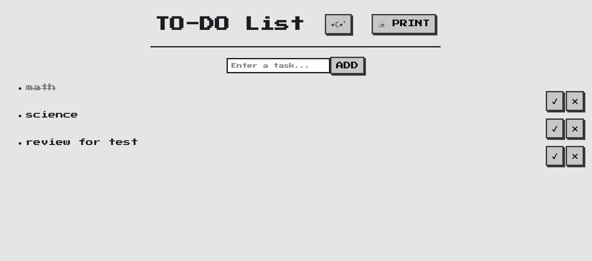

# To-Do App

A pixel-themed To-Do application built with HTML, CSS, and JavaScript.

## Features
- Add tasks to your to-do list.
- Mark tasks as completed.
- Delete tasks from the list.
- Reorder tasks with drag-and-drop.
- Save tasks in local storage so they persist across sessions.
- Toggle between light and dark themes.
- Print your to-do list.

## License
This project is licensed under the MIT License.
